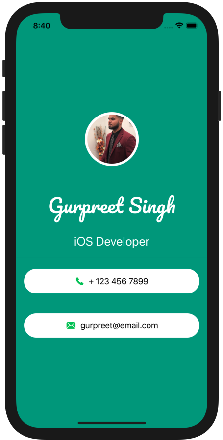

# SwiftUI-Portfolio-Card
### Screen Shots

---

### Table of Contents

- [Description](#description)
- [How To Use](#how-to-use)
- [Author Info](#author-info)

## Description

- Simple SwiftUI based portfolio card

---

### What I Learned:

- HStack, ZStack, VStacks
- Using various modifiers
- Dividers
- Extracting Views and managing various Swift files.

---

## How To Use

- Clone the project and run it on Xcode
---

## Author Info
- Website - [LinkedIn: Gurpreet Singh](https://www.linkedin.com/in/gurpreet-singh-a2651b107/)

[Back To The Top](#SwiftUI-Portfolio-Card)
